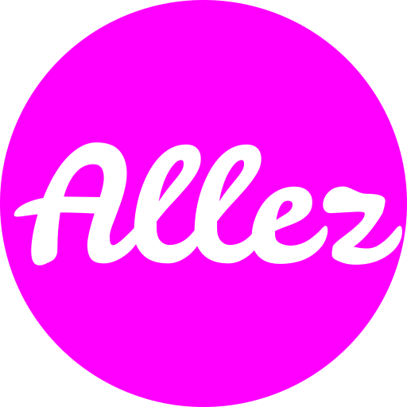

<br/>

<p align="center">
  
</p>

<p align="center">
基于 Vue3 和 Vite 生态打造，助力于快速构建web应用程序。
</p>

<p align="center">
  
  
  
  
  
</p>

## 功能
- ⚡ 基于Vite+Vue3，快速开发和构建强壮的应用
- 🎨 使用原子化CSS构建方案UnoCSS
- ✨ 使用Vitest作为测试框架，保障功能稳定性  
- 🔖 使用Typescript，提供静态类型检查和类型提示
- 💎 使用Github Action持续集成，自动部署和发布
- 🎲 使用Husky和Eslint检查代码规范，保障良好的代码样式

## 快速开始
1. 安装依赖
```
pnpm install allezd -D
```
2. 引入依赖
```ts
import AllezUi from 'allezd';
import 'allezd/dist/assets/entry.css'

createApp(App).use(AllezUi).mount('#app');
```
3. 在组件中使用
```vue
<template>
  <div>
    <Button color="red">测试按钮</Button>
  </div>
</template>
```

## 参考链接
- [Vite官网](https://vitejs.dev/)
- [Vitepress官网](https://vitepress.vuejs.org)
- [Vue官网](https://vuejs.org/)

## TODO

- [ ] Vercel部署
- [x] 实现按需引入
- [x] Monorepo管理仓库